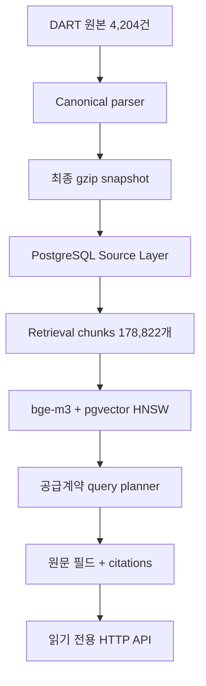

# Disclosure Analyst Agent

국내 상장사 공시 원문을 추적 가능한 Canonical 데이터로 보존하고,
PostgreSQL 기반 구조화 검색과 pgvector 기반 의미 검색을 거쳐 근거가 포함된 답변을
만드는 프로젝트입니다.

현재 브랜치는 `perf/canonical-pipeline`입니다. Canonical Source Layer, retrieval chunks,
`bge-m3` embedding과 공급계약 4개 필드 검색을 완료했고, 검증된 검색 계약을 읽기 전용
HTTP API로 제공하는 단계입니다.

## 현재 상태

| 영역 | 상태 | 결과 |
|---|---|---|
| 원본 corpus | 완료 | 70개사, 4,204 filing packages |
| Canonical schema | 확정 | schema `2.2.0`, DART parser `2.2.1` |
| 최종 snapshot | 확정 | `canonical-v221-final.jsonl.gz`, 약 1.43 GB |
| Canonical 품질 | 승인 | 4,619 documents, failed 0 |
| Source Layer DB | 완료 | 2,700,533 blocks, 1,580,832 tables |
| Retrieval chunks | 완료·검증 | 178,822 chunks, run `c700b5a3a6cfa055be147bc71dd478ca` |
| Embedding | 완료·검증 | `bge-m3` 1024차원 178,822개, input v2 |
| 검색 | 완료·검증 | pgvector HNSW, dense vector-first, provenance/citation |
| 공급계약 vertical | 개발 검증 완료 | 계약상대방·금액·시작일·종료일, QA v2 40/40 |
| 읽기 전용 API | 구현 | `/v1/query`, liveness/readiness, 안전한 오류 계약 |
| Ncloud 배포 기반 | 구현 | Linux container, private DB network, bearer token, healthcheck |
| 정정·해지 lineage | 미구현 | 최신 유효 계약·잔여 수주에는 사용하지 않음 |
| 범용 공시 Agent | 미구현 | 공급계약 외 vertical은 별도 확장 필요 |

최종 Canonical 상태는 다음과 같습니다.

```text
packages                 4,204
semantic documents       4,619
tables               1,580,832
success                  4,513
partial                    106
failed                        0
```

`partial` 106건도 버리지 않습니다. 모두 Exchange parser 진단이며 Source Layer에
`parse_status`와 issue를 함께 적재합니다. Audit은 품질 진단 자료이지 전체 corpus에 대한
무손실 인증서는 아닙니다.

## 처리 구조



Canonical은 보존·재처리를 위한 기준 데이터이고, 온라인 질의는 PostgreSQL과 pgvector를
사용합니다. 질문할 때 1.43 GB snapshot 전체를 다시 읽지 않습니다.

## 개발 환경

- Python `>=3.11,<3.13` — Python 3.12 권장
- Windows PowerShell
- Docker Desktop
- PostgreSQL 16 + pgvector

```powershell
py -3.12 -m venv .venv
.venv\Scripts\Activate.ps1
python -m pip install --upgrade pip
python -m pip install -e ".[dev]"
```

## 격리된 perf PostgreSQL

`model/data-pipeline`에서 사용하는 기존 DB는 건드리지 않습니다.

| 항목 | 기존 model 환경 | 현재 perf 환경 |
|---|---|---|
| Container | `disclosure-postgres` | `disclosure-perf-postgres` |
| Host port | `5432` | `55432` |
| Database | `disclosure` | `disclosure_perf` |
| Compose project | 기존 project | `disclosure-perf` |
| Volume | 기존 volume | `disclosure_perf_pgdata` |

```powershell
Copy-Item .env.perf.example .env.perf

docker compose `
  -p disclosure-perf `
  -f compose.perf.yaml `
  --env-file .env.perf `
  up -d
```

기본 `compose.yaml`을 실행하거나 기존 컨테이너·volume을 삭제하지 않습니다.

## 최종 Canonical 검증

재파싱하지 않고 압축 snapshot을 스트리밍하며 package·document·table 수와 논리적
SHA-256을 검증합니다.

```powershell
python scripts/validate_effective_canonical.py `
  --input data\processed\canonical-v221-final.jsonl.gz `
  --manifest data\processed\canonical-v221-final.manifest.json
```

기존 27 GB base와 overlay 방식은 재현성 확인을 위해 호환되지만 production 입력은 위의
단일 gzip snapshot입니다.

## Source Layer migration과 적재

현재 PowerShell에 perf DB URL만 주입합니다. 값은 Git에 올리지 않는 `.env.perf`에서
읽습니다.

```powershell
$PerfDatabaseUrl = (
  Get-Content .env.perf |
    Where-Object { $_ -like "PERF_DATABASE_URL=*" } |
    Select-Object -First 1
) -replace "^PERF_DATABASE_URL=", ""

if (-not $PerfDatabaseUrl) {
  throw "PERF_DATABASE_URL is missing from .env.perf"
}

$env:DATABASE_URL = $PerfDatabaseUrl

python -c @'
import os
from sqlalchemy.engine import make_url
u = make_url(os.environ["DATABASE_URL"])
print(u.host, u.port, u.database)
'@
alembic upgrade head
```

출력은 `localhost 55432 disclosure_perf`여야 합니다.

```powershell
python scripts/load_source_layer.py `
  --input data\processed\canonical-v221-final.jsonl.gz `
  --manifest data\processed\canonical-v221-final.manifest.json `
  --database-url $PerfDatabaseUrl `
  --progress-every 25

python scripts/verify_source_layer_db.py `
  --database-url $PerfDatabaseUrl
```

Loader는 `source_staging`에 먼저 적재하고 전체 count와 참조 무결성을 검사한 뒤 하나의
transaction으로 public Source Layer에 반영합니다. 중간 실패 시 기존 public snapshot은
변경되지 않습니다.

## 폴더 구조

```text
.
├── alembic/
│   └── versions/                    # PostgreSQL schema migrations
├── config/                          # 추출·검색 정책 설정
├── data/
│   ├── manifest.jsonl               # 4,204개 filing inventory
│   ├── raw/                         # 원본 공시, 수정 금지
│   ├── processed/                   # Canonical/manifest 생성물, Git 제외
│   └── quality/                     # audit/profile 결과, Git 제외
├── docs/
│   ├── canonical-v221-acceptance.md # Canonical 승인 근거
│   ├── perf-docker.md               # 격리 DB 운영 방법
│   └── source-layer.md              # Source Layer 상세 설계
├── scripts/                         # audit, validation, load, verification CLI
├── src/disclosure_agent/
│   ├── domain/                      # Canonical 및 event 모델
│   ├── inventory/                   # manifest와 원본 파일 연결
│   ├── parsing/                     # DART/Exchange/PDF parser
│   ├── extractors/                  # 공급계약 field/event/lineage 추출
│   ├── subsets/                     # 공급계약 subset과 lifecycle
│   ├── storage/                     # JSONL reader, ORM, repositories
│   ├── services/                    # ingestion과 application orchestration
│   ├── api/                         # FastAPI endpoint와 공개 schema
│   ├── retrieval/                   # chunks, embedding, search, query service
│   └── llm/                         # 향후 HyperCLOVA X namespace
└── tests/
    ├── unit/                        # parser, extractor, storage 단위 테스트
    ├── integration/                 # PostgreSQL/API 통합 테스트
    └── fixtures/                    # 재현 가능한 소형 원본 표본
```

## 읽기 전용 공급계약 API

API는 active embedding run이 승인된 `retrieval-embedding-v2`인지 확인하고 모든 DB
transaction에 `READ ONLY`를 적용합니다. 클라이언트는 embedding run, 검색 모드,
document subtype을 변경할 수 없습니다.

실제 키는 Git에서 제외되는 `.env.perf`에만 저장합니다.

```text
CLOVASTUDIO_API_KEY=실제_서비스_API_키
```

로컬 전용으로 실행합니다.

```powershell
python -m uvicorn disclosure_agent.api.main:app `
  --host 127.0.0.1 `
  --port 8000
```

다른 PowerShell 창에서 확인합니다.

```powershell
Invoke-RestMethod http://127.0.0.1:8000/health/live
Invoke-RestMethod http://127.0.0.1:8000/health/ready

$Body = @{
  question = "삼성중공업의 단일판매 공급계약 상대방과 계약금액, 계약기간"
  company = "삼성중공업"
  top_k = 5
} | ConvertTo-Json

Invoke-RestMethod `
  -Method Post `
  -Uri http://127.0.0.1:8000/v1/query `
  -ContentType "application/json; charset=utf-8" `
  -Body ([Text.Encoding]::UTF8.GetBytes($Body))
```

지원 범위, 응답 schema와 오류 계약은 [API 운영 문서](docs/contract-query-api.md)에
정리되어 있습니다.

## Ncloud 배포 준비

검증된 DB를 새로 계산하지 않고 PostgreSQL custom-format dump로 옮기는 단일 Linux 서버
배포 구성이 준비되어 있습니다. 배포 API는 비루트·읽기 전용 container로 실행하고,
PostgreSQL port는 공개하지 않으며 query endpoint에 별도 bearer token을 요구합니다.

```bash
cp .env.deploy.example .env.deploy
chmod 600 .env.deploy

docker compose \
  -p disclosure-deploy \
  -f compose.deploy.yaml \
  --env-file .env.deploy \
  config --quiet
```

서버·스토리지 준비, 기존 178,822개 embedding DB의 dump/restore, localhost smoke 순서는
[Ncloud 배포 문서](docs/ncloud-deployment.md)를 따릅니다. 분산 QPM limiter를 구현하기
전까지 API process와 replica는 각각 1개로 유지합니다.

서버를 만들기 전에 Windows 로컬 Docker에서 실제 perf DB를 대상으로 전체 preflight를
먼저 통과시킵니다. 이 명령은 API image build, 인증, 실제 검색, 동시 요청, container
restart와 DB 무변경을 검사하고 preflight API container만 정리합니다.

```powershell
powershell -ExecutionPolicy Bypass `
  -File scripts\test_local_deployment.ps1
```

마지막 `status verified` 전에는 Ncloud로 DB를 복사하지 않습니다.

## 테스트

```powershell
pytest -q
ruff check src tests scripts
ruff format --check src tests scripts
python scripts/canonical_audit.py --self-test
```

## 데이터 원칙

- `data/raw`와 승인된 Canonical snapshot은 수정하지 않습니다.
- `filing_id`, `document_id`, `block_id`, `table_id`, source locator를 끝까지 유지합니다.
- 수치는 semantic extraction 후에도 canonical cell과 원본 위치로 역추적할 수 있어야
  합니다.
- `partial`을 숨기거나 제외하지 않습니다.
- Parser를 다시 열기보다 downstream evidence로 실제 보존 손실이 확인될 때만
  수정합니다.
- 생성된 대용량 데이터와 로컬 DB credential은 Git에 올리지 않습니다.

세부 운영 기록은 [Canonical 승인](docs/canonical-v221-acceptance.md),
[perf Docker](docs/perf-docker.md), [Source Layer](docs/source-layer.md)를 참고하세요.
