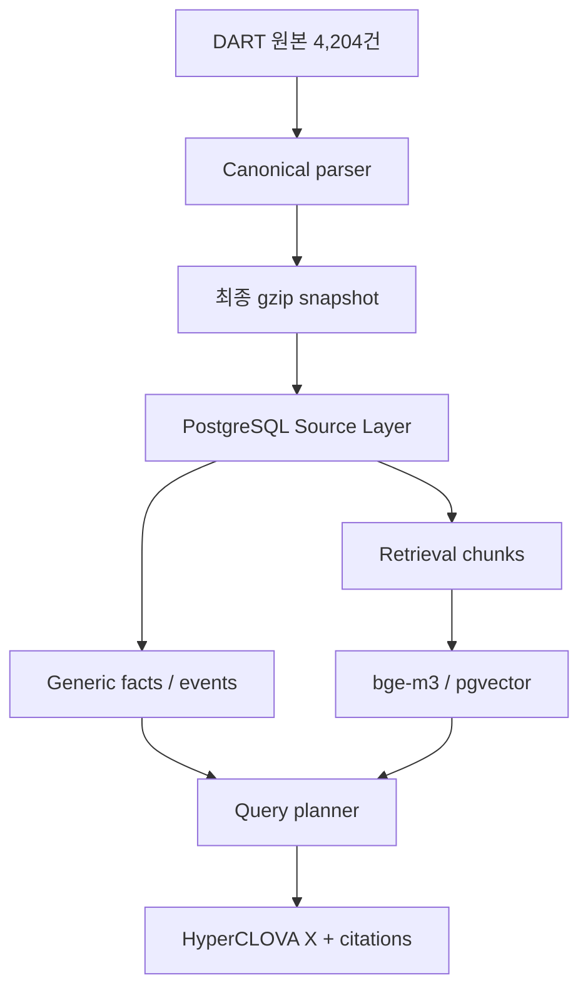

# Disclosure Analyst Agent

국내 상장사 공시 원문을 추적 가능한 Canonical 데이터로 보존하고,
PostgreSQL 기반 구조화 검색과 pgvector 기반 의미 검색을 거쳐 근거가 포함된 답변을
만드는 프로젝트입니다.

현재 브랜치는 `perf/canonical-pipeline`입니다. Canonical parser와 최종 snapshot은
확정됐고, 격리된 Source Layer와 Retrieval Chunk 적재·검증까지 완료한 상태입니다.

## 현재 상태

| 영역 | 상태 | 결과 |
|---|---|---|
| 원본 corpus | 완료 | 70개사, 4,204 filing packages |
| Canonical schema | 확정 | schema `2.2.0`, DART parser `2.2.1` |
| 최종 snapshot | 확정 | `canonical-v221-final.jsonl.gz`, 약 1.43 GB |
| Canonical 품질 | 승인 | 4,619 documents, failed 0 |
| Source Layer 코드 | 구현 | migration, staging, atomic promotion, 검증기 |
| Source Layer DB | 완료 | 70 companies, 4,204 filings, 2,700,533 blocks |
| 공급계약 vertical slice | 구현 | 1,106 packages, correction 563건 |
| Retrieval chunks | 완료 | 178,822 chunks, provenance/coverage 검증 |
| Embedding layer | 구현 | CLOVA bge-m3 1,024D, resumable loader/검증/검색 CLI |
| Generic facts | 진행 중 | periodic numeric table structured lane 예정 |
| Retrieval / API / LLM | 진행 중 | embedding 적재 후 hybrid planner/HyperCLOVA X 연결 |

최종 Canonical 상태는 다음과 같습니다.

```text
packages                 4,204
semantic documents       4,619
tables               1,580,832
success                  4,513
partial                    106
failed                        0
```

`partial` 106건도 버리지 않습니다. 모두 Exchange parser 진단이며 Source Layer에
`parse_status`와 issue를 함께 적재합니다. Audit은 품질 진단 자료이지 전체 corpus에 대한
무손실 인증서는 아닙니다.

## 처리 구조



Canonical은 보존·재처리를 위한 기준 데이터이고, 온라인 질의는 PostgreSQL과 pgvector를
사용합니다. 질문할 때 1.43 GB snapshot 전체를 다시 읽지 않습니다.

## 개발 환경

- Python `>=3.11,<3.13` — Python 3.12 권장
- Windows PowerShell
- Docker Desktop
- PostgreSQL 16 + pgvector

```powershell
py -3.12 -m venv .venv
.venv\Scripts\Activate.ps1
python -m pip install --upgrade pip
python -m pip install -e ".[dev]"
```

## 격리된 perf PostgreSQL

`model/data-pipeline`에서 사용하는 기존 DB는 건드리지 않습니다.

| 항목 | 기존 model 환경 | 현재 perf 환경 |
|---|---|---|
| Container | `disclosure-postgres` | `disclosure-perf-postgres` |
| Host port | `5432` | `55432` |
| Database | `disclosure` | `disclosure_perf` |
| Compose project | 기존 project | `disclosure-perf` |
| Volume | 기존 volume | `disclosure_perf_pgdata` |

```powershell
Copy-Item .env.perf.example .env.perf

docker compose `
  -p disclosure-perf `
  -f compose.perf.yaml `
  --env-file .env.perf `
  up -d
```

기본 `compose.yaml`을 실행하거나 기존 컨테이너·volume을 삭제하지 않습니다.

## 최종 Canonical 검증

재파싱하지 않고 압축 snapshot을 스트리밍하며 package·document·table 수와 논리적
SHA-256을 검증합니다.

```powershell
python scripts/validate_effective_canonical.py `
  --input data\processed\canonical-v221-final.jsonl.gz `
  --manifest data\processed\canonical-v221-final.manifest.json
```

기존 27 GB base와 overlay 방식은 재현성 확인을 위해 호환되지만 production 입력은 위의
단일 gzip snapshot입니다.

## Source Layer migration과 적재

현재 PowerShell에 perf DB URL만 주입합니다. 값은 Git에 올리지 않는 `.env.perf`에서
읽습니다.

```powershell
$PerfDatabaseUrl = (
  Get-Content .env.perf |
    Where-Object { $_ -like "PERF_DATABASE_URL=*" } |
    Select-Object -First 1
) -replace "^PERF_DATABASE_URL=", ""

if (-not $PerfDatabaseUrl) {
  throw "PERF_DATABASE_URL is missing from .env.perf"
}

$env:DATABASE_URL = $PerfDatabaseUrl

python -c @'
import os
from sqlalchemy.engine import make_url
u = make_url(os.environ["DATABASE_URL"])
print(u.host, u.port, u.database)
'@
alembic upgrade head
```

출력은 `localhost 55432 disclosure_perf`여야 합니다.

```powershell
python scripts/load_source_layer.py `
  --input data\processed\canonical-v221-final.jsonl.gz `
  --manifest data\processed\canonical-v221-final.manifest.json `
  --database-url $PerfDatabaseUrl `
  --progress-every 25

python scripts/verify_source_layer_db.py `
  --database-url $PerfDatabaseUrl
```

Loader는 `source_staging`에 먼저 적재하고 전체 count와 참조 무결성을 검사한 뒤 하나의
transaction으로 public Source Layer에 반영합니다. 성공하면 같은 transaction에서 staging을
비우며, 중간 실패 시 기존 public snapshot은 변경되지 않습니다.

## Retrieval chunk 계획과 적재

Source Layer를 바꾸지 않는 read-only planner로 narrative 병합과 table lane을 결정합니다.
승인된 v4 정책은 narrative 133,092개와 vector 대상 table 33,136개를 계약으로 고정합니다.
table chunk 36,959개는 문자 길이 기반 사전 추정값이므로 실제 행 경계 분할 결과와 다를 수
있습니다.

```powershell
python scripts/plan_retrieval_chunks.py `
  --database-url $PerfDatabaseUrl `
  --tables-only `
  --reuse-narrative-plan data\quality\retrieval-chunk-plan-v3.json `
  --output data\quality\retrieval-chunk-plan-v4.json
```

Periodic 숫자표는 SQL structured lane, 나머지 periodic 표는 lexical lane으로 보내며
1,580,832개 원본 표는 Source Layer에 모두 유지합니다.

```powershell
alembic upgrade head

python scripts/load_retrieval_chunks.py `
  --database-url $PerfDatabaseUrl `
  --plan data\quality\retrieval-chunk-plan-v4.json

python scripts/verify_retrieval_chunks_db.py `
  --database-url $PerfDatabaseUrl `
  --plan data\quality\retrieval-chunk-plan-v4.json
```

Loader는 전체 작업을 하나의 transaction으로 처리합니다. 검증까지 성공한 run만 active로
전환되고, 실패하면 새 chunk와 run metadata가 모두 rollback되어 기존 active run을 보존합니다.
각 chunk에는 filing/document/section, source block/table ID와 content SHA-256이 남습니다.
Embedding 모델과 차원이 확정되기 전까지 vector 컬럼은 의도적으로 만들지 않습니다.

## Embedding 적재와 검색

검증된 active chunk run은 178,822개입니다. CLOVA Studio Embedding v2의 `bge-m3`
(1,024 dimensions, cosine)을 별도 versioned run으로 적재합니다. 먼저 migration과 dry-run,
100건 API smoke를 통과한 뒤 전체 적재를 재개합니다.

```powershell
alembic upgrade head

python scripts/load_retrieval_embeddings.py `
  --database-url $PerfDatabaseUrl `
  --dry-run
```

API 키·100건 smoke·전체 resume·검증·검색 명령은
[Retrieval embeddings](docs/retrieval-embeddings.md)에 정리되어 있습니다. API 키는 Git,
DB, 명령행 인자에 저장하지 않습니다.

## 폴더 구조

```text
.
├── alembic/
│   └── versions/                    # PostgreSQL schema migrations
├── config/                          # 추출·검색 정책 설정
├── data/
│   ├── manifest.jsonl               # 4,204개 filing inventory
│   ├── raw/                         # 원본 공시, 수정 금지
│   ├── processed/                   # Canonical/manifest 생성물, Git 제외
│   └── quality/                     # audit/profile 결과, Git 제외
├── docs/
│   ├── canonical-v221-acceptance.md # Canonical 승인 근거
│   ├── perf-docker.md               # 격리 DB 운영 방법
│   └── source-layer.md              # Source Layer 상세 설계
├── scripts/                         # audit, validation, load, verification CLI
├── src/disclosure_agent/
│   ├── domain/                      # Canonical 및 event 모델
│   ├── inventory/                   # manifest와 원본 파일 연결
│   ├── parsing/                     # DART/Exchange/PDF parser
│   ├── extractors/                  # 공급계약 field/event/lineage 추출
│   ├── subsets/                     # 공급계약 subset과 lifecycle
│   ├── storage/                     # JSONL reader, ORM, repositories
│   ├── services/                    # ingestion과 application orchestration
│   ├── api/                         # 향후 HTTP API namespace
│   ├── retrieval/                   # chunk planner와 materialization policy
│   └── llm/                         # 향후 HyperCLOVA X namespace
└── tests/
    ├── unit/                        # parser, extractor, storage 단위 테스트
    ├── integration/                 # 향후 DB/API 통합 테스트
    └── fixtures/                    # 재현 가능한 소형 원본 표본
```

## 테스트

```powershell
pytest -q
ruff check src tests scripts
ruff format --check src tests scripts
python scripts/canonical_audit.py --self-test
```

## 데이터 원칙

- `data/raw`와 승인된 Canonical snapshot은 수정하지 않습니다.
- `filing_id`, `document_id`, `block_id`, `table_id`, source locator를 끝까지 유지합니다.
- 수치는 semantic extraction 후에도 canonical cell과 원본 위치로 역추적할 수 있어야
  합니다.
- `partial`을 숨기거나 제외하지 않습니다.
- Parser를 다시 열기보다 downstream evidence로 실제 보존 손실이 확인될 때만
  수정합니다.
- 생성된 대용량 데이터와 로컬 DB credential은 Git에 올리지 않습니다.

세부 운영 기록은 [Canonical 승인](docs/canonical-v221-acceptance.md),
[perf Docker](docs/perf-docker.md), [Source Layer](docs/source-layer.md)를 참고하세요.
